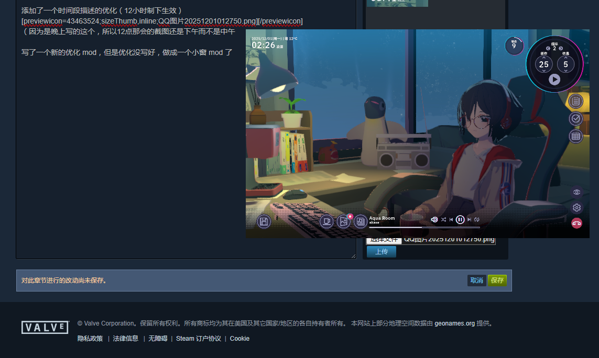
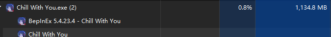
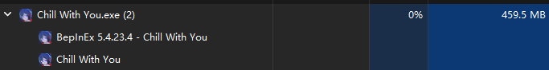
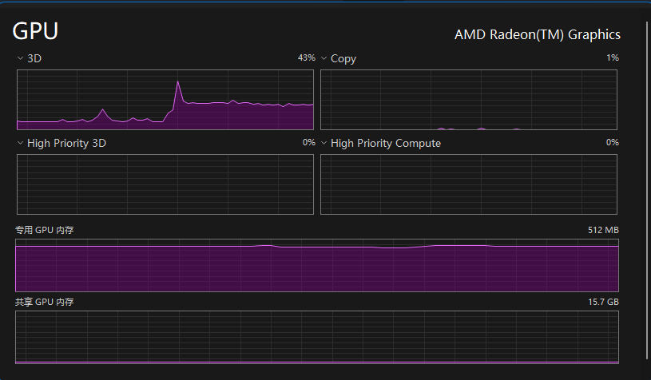
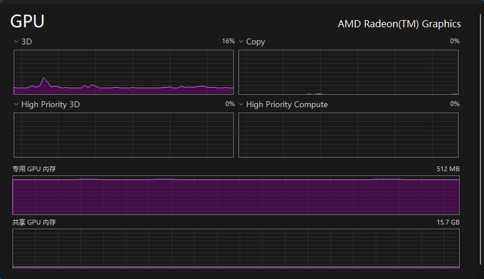

# iGPU Savior（性能和体验优化插件）


[](https://opensource.org/licenses/MIT)
[](https://dotnet.microsoft.com/download/dotnet-framework/net472)
[](https://github.com/BepInEx/BepInEx)
<a href="https://github.com/anomalyco/opencode"></a>
[](https://opencode.ai/go?ref=X83D5WQ2NS)
> 使用 Opencode 等工具进行构建，由 Opencode GO 提供模型支持


一个用于游戏 《*放松时光：与你共享Lo-Fi故事*》 的性能和体验优化 BepInEx 插件。可以降低资源占用，并提供镜像、小窗、竖屏等增强体验模式。

---

[](https://store.steampowered.com/app/3548580/)

> 「放松时光：与你共享Lo-Fi故事」是一个与喜欢写故事的女孩聪音一起工作的有声小说游戏。您可以自定义艺术家的原创乐曲、环境音和风景，以营造一个专注于工作的环境。在与聪音的关系加深的过程中，您可能会发现与她之间的特别联系。
---


> 所有代码均由 AI 编写，人工仅作反编译和排错处理。
> 这是我第二次用 AI 为 Unity 游戏做 MOD，有问题请反馈，虽然反馈了我也是再去找 AI 修就是了🫥

---

关联我写的第一个同步 mod：[Chill Env Sync](https://github.com/Small-tailqwq/RealTimeWeatherMod)
> 搭配此 MOD，可以实现基于现实日出日落与天气的同步功能。


## 快速演示


<p align="center"><i>在 Steam 社区发帖的同时，用小窗观看游戏画面</i></p>

#### ⚡ 性能优化
显著降低游戏资源占用，让你的电脑更流畅：

**内存占用对比：**


<p align="center"><i>优化前：内存占用 1,134.8 MB</i></p>


<p align="center"><i>优化后：内存占用 459.5 MB</i></p>

- 优化前：1,134.8 MB
- 优化后：459.5 MB
- **节省约 60% 内存占用** 💾

**GPU 占用对比：**


<p align="center"><i>优化前：3D 占用率 43%，持续高负载</i></p>


<p align="center"><i>优化后：3D 占用率 16%，显著降低</i></p>

- 优化前：3D 占用率 43%，持续高负载
- 优化后：3D 占用率 16%，显著降低
- **减少约 63% 的 GPU 负担** 🎮

> **⚠️ 性能优化原理说明：**  
> 测试环境为 AMD 4800H 笔记本核显；小窗模式默认分辨率为原始分辨率的 1/3，*减少约 67% 的渲染像素*


## ✨ 主要功能


- `F2` - 切换土豆模式（降低画质，减少占用）
	- 三级模式系统：正常 / 土豆(手动F2) / 后台(失焦自动)
	- 关闭土豆模式时自动按焦点状态切回正常或后台模式
- `F3` - 在无边框小窗和上一个窗口形态之间游龙切换
	- 小窗记忆位置和窗口尺寸，下次进入自动恢复
	- 可配置进入小窗时自动隐藏游戏内 UI
- `F4` - 切换摄像机镜像模式（左右翻转画面）
	- 视觉、输入、音频完全镜像，沉浸式体验
	- 自适应窗口大小变化，无需手动调整
- `F5` - 切换竖屏优化模式（增大竖屏视角）
	- 可在配置中设置启动时自动启用
	- 支持在游戏内 MOD 设置中开关"竖优自启动"

- 为 MOD 提供了设置 GUI 的注册功能
  - 以本 mod 为前置 mod，其他 mod 可以自行接入配置项至原生设置彩蛋。本 mod 提供了开关、输入框、下拉选项等输入控件
- 服装轮换功能
  - 可通过配置文件关闭服装轮换功能
  - 也可通过设置 GUI 许愿下次见面想看到的衣服
- 笔记等内容的导出与删除二次确认
  - 支持导出笔记为兼容性最佳的 txt 格式（win only）
  - 支持笔记、代办的删除二次确认


## ⚠️ 本项目可能有

- ⛄**西伯利亚**：土豆只是一个比喻，与任何硬件、厂商、西伯利亚无关。请善待每一颗土豆🤎
- 💥**莫名冲突**：如果未来游戏更新或者 Mod 大井喷，本插件很可能与其他插件发生冲突。*因为我也知道我和 AI 配合写得很烂，届时还请别抱太大修复希望*
- 💸**仅供学习**：本插件采用了 MIT许可证，法律上来说你可以想干啥干啥，但是请**不要直接拿 DLL 去卖**。
- 😵‍💫**粗制滥造**：本插件完全由 AI 编写，可能存在各种问题和漏洞，请谨慎使用。*我完全不懂 C#，那你叫我怎么办嘛*
- 🤖**智械危机**：使用本插件可能会加速AI统治世界的进程，后果自负。（<---这段不是我自己写的）


## 🎮 支持的环境类型

### 后台省电优化（新增）
窗口失焦时自动激活：限帧 10fps + 渲染分辨率 0.1 + 关闭阴影 + 关闭垂直同步。窗口获焦或进入小窗时自动恢复画质。

### 土豆模式
手动 F2 切换，画面变糊。关闭时自动按焦点状态回到正常或后台模式。

### 无边框小窗模式
功能稳定，如有问题欢迎提交 Issue。


### 未来计划

> 🗒️ 本项目的未来计划和待办清单

- [ ] 整理开发经验文档

## 📦 安装方法

### 前置要求
- 游戏本体
- [BepInEx 5.x](https://github.com/BepInEx/BepInEx/releases) 版本，别下 6.0

### 安装步骤

1. 确保已正确安装 BepInEx 框架
2. 将下载好的 `iGPU.Savior.dll` 放入 `BepInEx/plugins/` 目录
3. 启动游戏，插件将自动加载
4. 编辑配置文件调整各种快捷键

## ⚙️ 配置说明

首次运行后，配置文件将生成在 `BepInEx/config/chillwithyou.potatomode`

### 配置项说明

```ini
[Hotkeys]

## 切换土豆模式的按键
# Setting type: KeyCode
# Default value: F2
# 默认F2，能用就别乱改
PotatoModeKey = F2

## 切换画中画小窗的按键
# Setting type: KeyCode
# Default value: F3
# 默认F3，能用就别乱改
PiPModeKey = F3

## 切换摄像机镜像的按键(左右翻转画面)
# Setting type: KeyCode
# Default value: F4
# 默认F4，镜像模式包含视觉、输入、音频完全翻转
CameraMirrorKey = F4

## 切换竖屏优化的按键(方便调试参数)
# Setting type: KeyCode
# Default value: F5
# 默认F5，能用就别乱改
PortraitModeKey = F5

[Camera]

## 启动时是否自动启用摄像机镜像(默认关闭,建议先用UE Explorer测试)
# Setting type: Boolean
# Default value: false
EnableMirrorOnStart = false

## 启动时是否自动启用竖屏优化(默认关闭,如启用会在游戏初始化后自动激活)
# Setting type: Boolean
# Default value: false
# 注意：此功能会在场景加载后15秒自动启用，确保游戏完全初始化
EnablePortraitMode = false

[Performance]

## 窗口失焦时自动省电(限帧10fps+渲染分辨率0.1+关闭阴影)；小窗模式始终豁免
# Setting type: Boolean
# Default value: true
EnableBackgroundOptimization = true

[Window]

## 小窗初始缩放比例（之后会优先恢复上次自由尺寸和形状）
# Setting type: WindowScaleRatio
# Default value: OneThird
# 分别是三分之一，四分之一，五分之一。默认根据屏幕大小自动计算
# Acceptable values: OneThird, OneFourth, OneFifth
ScaleRatio = OneThird

## 拖动方式
# Setting type: DragMode
# Default value: Ctrl_LeftClick
# 支持 Ctrl+左键、Alt+左键、右键按住三种模式
# Acceptable values: Ctrl_LeftClick, Alt_LeftClick, RightClick_Hold
DragMethod = RightClick_Hold

## 进入小窗时通过游戏原生隐藏按钮自动隐藏GUI，退出时恢复
# Setting type: Boolean
# Default value: false
AutoHideGuiInPiP = false
```

## 🚀 使用方法

### 基础使用

- 观看演示视频：[时间、天气与土豆](https://www.bilibili.com/video/BV1JXSiB4EP1)
- 快捷键说明：
  - `F2` - 切换土豆模式
  - `F3` - 切换无边框小窗
  - `F4` - 切换摄像机镜像
  - `F5` - 切换竖屏优化

## 🔧 技术细节

- **框架**：BepInEx 5.x
- **目标框架**：.NET Framework 4.7.2
- **使用技术/工具**：
  - unity 相关的 mcp
  - 各种大语言模型

## 📝 版本历史

完整更新日志请查看 [CHANGELOG.md](CHANGELOG.md) 或 [Git 提交记录](https://github.com/Small-tailqwq/iGPUSaviorMod/commits/master)。

> 版本号由仓库根目录 `version.json` 管理，运行 `scripts/sync-version.ps1` 同步。

## 🐛 已知问题

- 土豆模式和后台模式同时降低渲染分辨率，窗口切换时可能有短暂画质跳变

## 🤝 贡献

欢迎提交 Issue 和 Pull Request！

### 关于反馈

如需反馈问题，请先确保问题“可复现”，并开启调试日志（BepInEx/config/BepInEx.cfg 中将 `Logging.Console` 设置为 `true`）。  
这时，游戏启动时会在控制台输出详细日志，有助于定位问题。

## 📄 许可证

本项目采用 **MIT 许可证** 开源。

**⚠️ 重要声明**：
- ✅ 可以自由使用、修改和分发
- ✅ 可以用于个人学习和研究
- 使用本软件产生的任何后果由使用者自行承担

详见 [LICENSE](LICENSE) 文件。

## 👨‍💻 作者

- GitHub: [@Small-tailqwq](https://github.com/Small-tailqwq)

## 🙏 致谢

- BepInEx 团队
- OpenCode
- 各种大模型团队

---

**免责声明**：本插件仅供学习交流使用，请勿用于商业用途。使用本插件产生的任何问题与作者无关。
